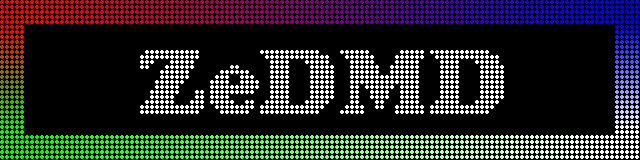
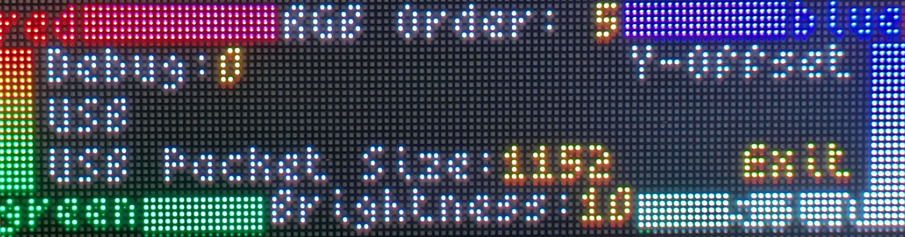
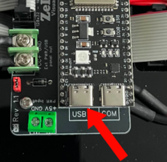

## About

ZeDMD is a "real" DMD designed for pinball emulations and other use cases. Originally developed by David "Zedrummer" Lafarge, the concept laid the foundation for what ZeDMD has become today. Markus Kalkbrenner, the current maintainer of ZeDMD, was inspired by the original idea and took the initiative to further develop and enhance it into the robust and versatile solution it is now.

ZeDMD is or will be supported by:
* [DMDExtensions](https://github.com/freezy/dmd-extensions)
* [VPX Standalone](https://github.com/vpinball/vpinball/tree/standalone)
* [PPUC](https://github.com/PPUC/ppuc)
* [batocera](https://batocera.org/)
* [libdmdutil](https://github.com/vpinball/libdmdutil)
* [DOF2DMD](https://github.com/DMDTools/DOF2DMD)
* [VPX Mobile iOS](https://apps.apple.com/mt/app/visual-pinball/id6547859926)
* VPX Mobile Android

A full tutorial of its installation is available in [English](https://www.pincabpassion.net/t14796-tuto-zedmd-installation-english) and in [French](https://www.pincabpassion.net/t14798-tuto-installation-du-zedmd)

Meanwhile, there are different "flavours" of the ZeDMD firmware. Because it pushes the cheap ESP32 to its limits, we can not provide a unified firmware, so you have to pick the appropriate one:
* ZeDMD 128x32: using two 64x32 panels driven by an ESP32 connected over USB or WiFi
* ZeDMD HD 256x64: using four 64x64 or two 128x64 panels driven by an ESP32 connected over USB or WiFi
* ZeDMD 128x64: using one 128x64 panel driven by an ESP32 connected over USB or WiFi, showing 128x32 content with an offset, suitable for mini cabinets
* ZeDMD S3 128x32: using two 64x32 panels driven by an ESP32 S3 N16R8 connected over USB CDC or WiFi
* ZeDMD S3 HD 256x64: using four 64x64 or two 128x64 panels  driven by an ESP32 S3 N16R8 connected over USB CDC or WiFi
* ZeDMD S3 128x64: using one 128x64 panel driven by an ESP32 S3 N16R8 connected over USB CDC or WiFi, showing 128x32 content with an offset, suitable for mini cabinets
* ZeDMD S3 AMOLED: using a small OLED driven by a LilyGo AMOLED T-Display-S3 V2 connected via USB CDC
* ZeDMD S3 AMOLED WiFi: using a small OLED driven by a LilyGo AMOLED T-Display-S3 V2 connected via WiFi

Here is a short demo of ZeDMD and ZeDMD HD in parallel:

[](https://youtu.be/B6D00oB4Co8)

## Flashing the firmware

There are different ways to flash the firmware on the ESP32.

### esptool

Download the appropriate zip file from the [latest release](https://github.com/PPUC/ZeDMD/releases/latest)'s assets section and extract it.

Install [esptool](https://github.com/espressif/esptool)

On Windows you should use `esptool.exe` instead of `esptool`.
If you have different devices attached via USB or if the ESP32 is not detected you could specifiy the concrete port.
For a Windows machine this could be:
```shell
esptool.exe --chip esp32 --port COM3 write_flash 0x0 ZeDMD.bin
```
On a unix-like system:
```shell
esptool --chip esp32 --port /dev/ttyUSB0 write_flash 0x0 ZeDMD.bin
```

The ESP32-S3 N16R8 is now fully supported too. To flash this device, simply modify the command seen above by appending `s3` to `esp32`, resulting in `esp32s3`.

### platformio ("from source")

```shell
pio run -t uploadfs -e 128x32
pio run -t upload -e 128x32
```

> [!WARNING]
>
> Starting with ZeDMD 5.1.0, we switched from platform-espressif32 to [pioarduino](https://github.com/pioarduino).
> If you did use `pio` with older ZeDMD versions already, you must remove the `.pio` folder once or you'll get compile / upload / runtime errors:
> ```shell
> rm -rf .pio
> ```

### ZeDMD Updater (Windows only)

Download and install the [ZeDMD_Updater](https://github.com/zesinger/ZeDMD_Updater) and follow its instructions.

## ZeDMD pinout diagram
ZeDMD utilizes HUB75 to display full-color content on your panels. To achieve this, the panels must be connected to specific GPIOs on your ESP32.
| ESP32 Dev Board | ESP32-S3-N16R8 | HUB75 pins |      
| -------------   | -------------  | ---------- |         
| GPIO 25         | GPIO 4         | R1         |          
| GPIO 27         | GPIO 6         | B1         |
| GPIO 14         | GPIO 7         | R2         |
| GPIO 13         | GPIO 16        | B2         |
| GPIO 23         | GPIO 18        | A          |
| GPIO 5          | GPIO 3         | C          |
| GPIO 16         | GPIO 41        | CLK        |
| GPIO 15         | GPIO 2         | OE         |
| GPIO 26         | GPIO 5         | G1         |
| GPIO 12         | GPIO 15        | G2         |
| GPIO 22         | GPIO 1         | E          |
| GPIO 19         | GPIO 8         | B          |
| GPIO 17         | GPIO 42        | D          |
| GPIO 4          | GPIO 40        | LAT        |

To navigate the menu and adjust settings, you'll need to configure a few buttons. However, only two buttons are essential to modify values and exit the menu. These two buttons are `Menu Left` and `Value +`.
| ESP32 Dev Board | ESP32-S3-N16R8 | Menu Button |      
| -------------   | -------------  | ------------|         
| GPIO 33         | GPIO 48        | Menu Left   |          
| NOT USED        | GPIO 47        | Menu Right  |
| GPIO 21         | GPIO 0         | Value +     |
| NOT USED        | GPIO 45        | Value -     |

## First start


After flashing the ZeDMD a settings menu will appear. Due to the variety of panels available on the market you will need to adjust the RGB values. On ZeDMD versions prior to v5.0.0, this can be done by pressing the RGB button. From v5.0.0 onwards, you can adjust the RGB values by navigating to the `RGB Order:` option at the top of the settings menu.
Then, adjust the RGB order by rotating the colors until the following alignment is achieved:
* The top-left corner displays `red` as red.
* `Green` appears as green.
* `Blue` is shown as blue.

> Unique to `128x64` builds:
> There is an option to adjust the `Y offset` of the displayed content.

Versions prior to V5.0.0 let you adjust the brightness using the brightness button. 
From v5.0.0 onwards, this is done by navigating to the `Brightness:` option in the settings menu.

Starting from version 5.1.0, a configurable `USB packet size:` option has been introduced. While the default value works for most setups, reducing the packet size may help resolve any issues you encounter.

The option above `USB packet size:` allows switching between `USB`, `SPI`, `WiFi UDP` and `WiFi TCP`. The USB option for the older ESP32 Dev board is self-explanatory. However, with the ESP32-S3-N16R8 you must use the left `USB` port, as shown in the picture.


>`SPI` is currently non-functional and serves only as a placeholder for future real pinball integration.

To increase the compatibility with some USB ports or hubs, the USB package size became configurable. The default value of 64 bytes is very low. If you notice stuttering of the DMD frames, try to increase this value.
Good values are 512 bytes for the original EPS32 and 1024 for the ESP32 S3. If ZeDMD doesn't work with these values, try a different USB port of your computer. In most cases not all of them and their driver chips are of the same quality.

When wanting to use WiFi it is recommended to start with `WiFi UDP` for seamless frame streaming, provided your WiFi connection is fast. If you encounter crashes or unusual behavior, try adjusting the `UDP Delay:` option. For fast connections, a value below `UDP Delay: 5` may work well. Values like `UDP Delay: 4` have been reported to perform effectively. While lowering the UDP delay may work well for some, values above `UDP Delay: 5` should be given a try before making the final decision to switch to `WiFi TCP` for slower streaming but improved reliability.

The `Debug:` option can be set to `Debug: 1` if requested by a ZeDMD developer to enable error tracking during testing. For regular use, this setting should always remain at `0`.

> [!WARNING]
>
> From version 5.0.0 onwards: once you’ve finished changing values, you must navigate to the 'Exit' button. This step is required to enable the ZeDMD to enter handshake mode.

## ZeDMD-WiFi

After activating either `WiFi UDP` or `WiFi TCP` in the settings menu, connect your mobile device or laptop to the `ZeDMD-WiFi` network using password `zedmd1234`.
Then, open your web browser and navigate to http://ZeDMD-WiFi.local (IP: 192.168.4.1) to access the configuration settings.

## IMPORTANT LEGAL NOTICES:

ZeDMD's firmware is open source and licensed as **GPLv2 or later** and can be ditributed under these terms.

For manufacturers or resellers of any shield, frame, ready-to-use devices or whatever linked to ZeDMD, our only request is that the device is **called as "ZeDMD something"** or **powered by ZeDMD**. "ZeDMD" should be what you see first when you look at the device. Also, **a link to this project** must be provided with the device.

ZeDMD uses
* [ESP32-HUB75-MatrixPanel-DMA](https://github.com/mrfaptastic/ESP32-HUB75-MatrixPanel-DMA)
* [Bounce2](https://github.com/thomasfredericks/Bounce2)
* [miniz](https://github.com/richgel999/miniz)
* [Tiny 4x6 Pixel Font](https://hackaday.io/project/6309-vga-graphics-over-spi-and-serial-vgatonic/log/20759-a-tiny-4x6-pixel-font-that-will-fit-on-almost-any-microcontroller-license-mit)
* [ESPAsyncWebServer]([https://github.com/me-no-dev/ESPAsyncWebServer](https://github.com/ESP32Async/ESPAsyncWebServer))
* ~~[JPEGDEC](https://github.com/bitbank2/JPEGDEC)~~
* [TFT_eSPI](https://github.com/Bodmer/TFT_eSPI)
* [RM67162 with fixes from Nikthefix](https://github.com/Xinyuan-LilyGO/T-Display-S3-AMOLED/issues/2)
* [pioarduino](https://github.com/pioarduino)

## FAQ

### "Where can I buy a ZeDMD?"

The intention of ZeDMD is to provide a cheap DIY DMD solution. The maintainers of this project don't run any shop to sell ready-to-use hardware!

Nevertheless, there are are some shops we are aware of who designed their own shields to build a ZeDMD.
And as this might ease the task to use a ZeDMD for some users, we agreed to add some links here:
* https://janspinballmods.com/mods/zedmd/shield-esp32-s3-not-included/
* https://shop.arnoz.com/en/dmd/87-esp-dmd-shield.html
* https://benfactory.fr/produit/zedmd-shield/
* https://www.smallcab.net/shield-zedmd-p-2697.html

There are also ready-to-use devices:
* https://janspinballmods.com/mods/zedmd/zedmd-s3-128x32-plug-and-play/
* https://benfactory.fr/produit/zedmd/
* https://www.smallcab.net/pack-zedmd-p-2698.html
* https://virtuapin.net/index.php?main_page=product_info&cPath=6&products_id=283

### My LED panels do not work; ghosting, wrong pixels, missing lines

The ZeDMD firmware supports a wide range of LED panels with different driver chips ... in theory.
In general, some driver chips require adjustments in the configuration, timings and the clock phase.
That can't be done with ZeDMD updater, but within the source code of the firmware. Here os some background information:
* https://github.com/mrcodetastic/ESP32-HUB75-MatrixPanel-DMA?tab=readme-ov-file#supported-panel-can-types
* https://github.com/mrcodetastic/ESP32-HUB75-MatrixPanel-DMA?tab=readme-ov-file#latch-blanking

These are the available config options:
https://github.com/mrcodetastic/ESP32-HUB75-MatrixPanel-DMA/blob/54ef6071663325e7b8f3a9e1e0db89b0b0b7398d/src/ESP32-HUB75-MatrixPanel-I2S-DMA.h#L235-L309

The pre-built firmware uses the default config which is suitable for the most common LED panels.
Obviously we can't provide a menu on the device to adjust these settings as you won't see them ;-)

But we consider to add support for these driver settings to libzedmd and the ini file of dmdserver so that these values could be adjusted and sent to ZeDMD before the panels get initialized.

We could also offer firmware builds for specific panels. But that would require someone to send over their panels to us so we can find out the correct config.

If you find out what config adjustment gets a specific panel to work, you should open an issue here and provide that information so that we could include it in the README and probably add a specific automated build for the next releases.

### I have installed all of the latest files, but I still get crashes on a Windows machine
A few users have reported that VPX and ZeDMD consistently crash if the latest Visual C++ Redistributable Runtime packages are not installed. To resolve this issue, ensure you have the most up-to-date runtime packages installed. If the latest version doesn’t resolve the issue, it may be necessary to install all available versions of the Visual C++ Redistributable Runtime packages.

Another potential issue could be outdated USB drivers. For the original ESP32 Development Board:
* https://www.silabs.com/developer-tools/usb-to-uart-bridge-vcp-drivers?tab=downloads

For the ESP32-S3-N16R8, we use the USB CDC port, which doesn't require a driver. But if if you use the alterantive UART version of the firmware, refer to the following link for more details:
* https://www.wch-ic.com/downloads/CH343SER_EXE.html

### ZeDMD crashed, how can I help to fix the issue

If you discover a crash, there's a good chance that a coredump has been written to the internal flash memory.
If you install the entire esp-idf, you can extract and interpret the coredump. `firmware.elf` is included in the release downloads since v5.1.2.
To get the coredump, has to be something like this:
```shell
python PATH_TO_ESP_IDF/esp-idf/components/espcoredump/espcoredump.py info_corefile PATH_TO_FIRMWARE_ELF/firmware.elf
```
Or on Windows:
```shell
PATH_TO_PYTHON\python.exe PATH_TO_ESP_IDF\esp-idf\components\espcoredump\espcoredump.py info_corefile PATH_TO_FIRMWARE_ELF\firmware.elf
```

If you used pio to build and flash the firmware, the command line on Linux or macOS could be like this:
```shell
python ~/esp/v5.3.2/esp-idf/components/espcoredump/espcoredump.py info_corefile .pio/build/S3-N16R8_128x32/firmware.elf
```
